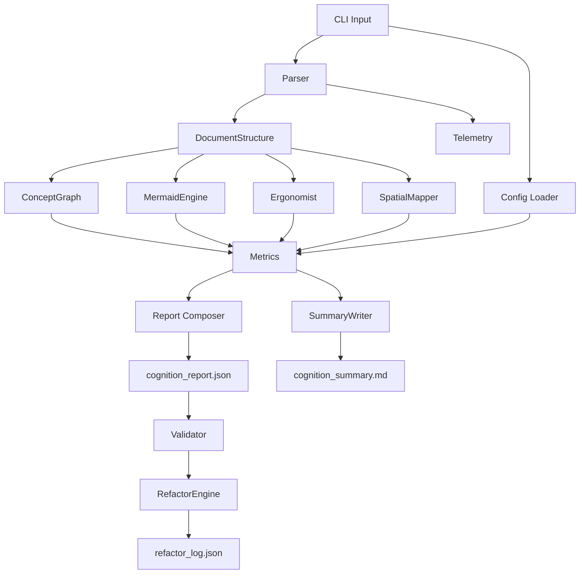

# Data Flow Diagram

The following diagram shows the full data flow between all system components.

This diagram intentionally shows a high degree of interconnection to demonstrate the visual load scoring.
